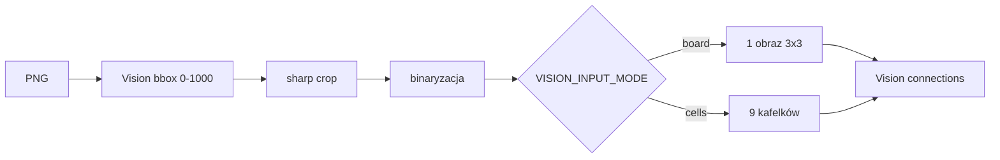

# S02E02 — `electricity` (agent + vision)

Autonomiczny agent rozwiązuje puzzle elektryczne 3×3: obraca płytki, aby dopasować układ kabli do wzoru docelowego i doprowadzić prąd do trzech elektrowni w obwodzie zamkniętym.

## Zadanie

Plansza to siatka 3×3 z elementami kabli. Źródło zasilania jest w **3x1** (lewy-dolny róg). Cel: dopasować układ do [schematu docelowego](https://hub.ag3nts.org/i/solved_electricity.png) — obwód zamknięty zasilający elektrownie PWR6132PL, PWR1593PL, PWR7264PL.

- Jedyna operacja: obrót pola o **90° w prawo** → `POST /verify` z `{ "rotate": "AxB" }`
- Stan bieżący: `{HUB_BASE_URL}/data/{API_KEY}/electricity.png`
- Adresacja pól: `AxB` (wiersz 1–3 od góry, kolumna 1–3 od lewej)

```
1x1 | 1x2 | 1x3
----|-----|----
2x1 | 2x2 | 2x3
----|-----|----
3x1 | 3x2 | 3x3
```

## Podejście

- **Preprocessing** (domyślnie wł.): vision bbox (raz) → crop → binaryzacja → vision connections
- **Vision** (Gemini) zwraca JSON: 9 pól × otwarte krawędzie `N/E/S/W`
- **Agent tekstowy** porównuje `current` vs `target`, planuje obroty (1–3 na pole) i woła `rotate_tile`
- Przy błędzie: ponowny odczyt planszy + korekty — **bez resetu**
- Pliki agenta tylko w sandboxie `workspace/` (wzór s1e4)

## Preprocessing obrazu




1. **Kalibracja bbox (raz na format)** — vision zwraca `{ x1, y1, x2, y2 }` w skali **0–1000**; podgląd cropu + checkpoint.

   Obraz **solved** (target) i **live z huba** mają inny układ/ramkę — potrzebne są **dwa osobne bboxy**. W kodzie rozróżnia je profil (`src/config.js`):

   | Profil | Stała | Plik bbox | Skrypt kalibracji | Użycie przy cropie |
   | ------ | ----- | --------- | ----------------- | ------------------ |
   | target | `BBOX_PROFILE_TARGET` | `reference/board_bbox_target.json` | `calibrate-bbox.js` (bez flagi) | `extract-target.js` — solved PNG |
   | live (hub) | `BBOX_PROFILE_LIVE` | `reference/board_bbox_live.json` | `calibrate-bbox.js --hub` | agent / `get_board_state` — PNG z huba |

   Preprocessing wybiera bbox automatycznie: `bboxProfile: BBOX_PROFILE_TARGET` dla solved, `bboxProfile: BBOX_PROFILE_LIVE` dla live. Nie mieszaj profili — crop solved obrazem live bbox (lub odwrotnie) da zły wynik vision.

   Stary `reference/board_bbox.json` jest jednorazowo migrowany do `board_bbox_target.json` przy pierwszym odczycie bbox.
2. **Każda analiza** — crop wg bbox profilu, binaryzacja, opcjonalnie podział na 9 kafelków → vision connections

## Narzędzia agenta


| Narzędzie          | Opis                                                     |
| ------------------ | -------------------------------------------------------- |
| `get_board_state`  | Pobiera PNG z huba, preprocess + vision → grid `current` |
| `get_target_board` | Zwraca wzór z `reference/target_board.json`              |
| `rotate_tile`      | `{ cell, times }` — 1–3 obroty CW, każdy = 1 POST        |


## Pierwsze uruchomienie

```powershell
cd ai-devs-tasks/tasks/s2e2

# 1a. Kalibracja bbox — obraz target (solved) → board_bbox_target.json
node scripts/calibrate-bbox.js

# 1b. Kalibracja bbox — live board z huba (inny format!) → board_bbox_live.json
node scripts/calibrate-bbox.js --hub

# Tylko ręczna korekta istniejącego bbox (bez AI):
node scripts/calibrate-bbox.js --manual          # target
node scripts/calibrate-bbox.js --hub --manual    # live

# 2. Target (automatycznie kalibruje bbox, jeśli brak pliku)
node scripts/extract-target.js

# 3. Agent
node app.js
```

Kalibracja z live board zamiast solved (patrz też krok 1b powyżej). Flaga `--hub` ustawia profil `BBOX_PROFILE_LIVE` i zapisuje bbox do `board_bbox_live.json` — osobno od targetu:

```powershell
node scripts/calibrate-bbox.js --hub
```

Po wykryciu bbox przez vision (lub w `--manual`) otwórz podgląd w `workspace/` (nazwa zależy od profilu, patrz `BBOX_PROFILES` w `src/config.js`):
- target: `bbox-preview-target.png`
- live: `bbox-preview-live.png`

Plik podglądu jest **nadpisywany** przy każdej iteracji. W konsoli:

- `[S] Save` — zapis do `reference/board_bbox_target.json` lub `board_bbox_live.json` (zależnie od profilu)
- `[A] Abort` — wyjście bez zapisu
- `[E] Edit` — podaj nowe `x1`, `y1`, `x2`, `y2` (0–1000; Enter = bez zmiany)
- wklej JSON: `{"x1":266,"y1":230,"x2":697,"y2":870}`

## Uruchomienie agenta

```powershell
node app.js
```

### Tryb testowy (`TEST_MODE=1`)

```powershell
$env:TEST_MODE = "1"
node app.js
```

1. **Pauza 1** — po probe vision: wydruk `current` vs `target`
2. Agent opisuje różnice tekstem (bez obrotów)
3. **Pauza 2** — wydruk analizy agenta
4. Po zatwierdzeniu: obroty przez `rotate_tile`

## Konfiguracja (env)

Z `ai-devs-tasks/.env`:

- `AI_DEVS_API_KEY`, `HUB_BASE_URL`
- `OPENROUTER_API_KEY` lub `OPENAI_API_KEY`
- `AGENT_MODEL` — domyślnie `gpt-5-mini`
- `VISION_MODEL` — domyślnie `google/gemini-3-flash-preview`
- `VISION_PREPROCESS` — domyślnie wł.; `0` = surowy PNG (legacy)
- `VISION_INPUT_MODE` — `board` (1 obraz) lub `cells` (9 kafelków, domyślnie)
- `VISION_CELL_INSET` — odcięcie z każdej krawędzi kafelka przed vision (domyślnie `0.1` = 10%; `0` = wył.)
- `VISION_PREPROCESS_DEBUG` — `1` = zapis PNG pośrednich w `workspace/preprocess-`*
- `VISION_BBOX_PADDING` — px paddingu przy cropie (domyślnie 6)
- `VISION_BINARIZE_THRESHOLD` — opcjonalny stały próg 0–255
- `TEST_MODE=1` — dwie pauzy agenta
- `LOG_LEVEL=debug` — pełne gridy w `logs/`

PowerShell — opcjonalnie 9 kafelków:

```powershell
$env:VISION_INPUT_MODE = "cells"
node app.js
```

Debug preprocessingu:

```powershell
$env:VISION_PREPROCESS_DEBUG = "1"
$env:LOG_LEVEL = "debug"
node scripts/extract-target.js
```

Logi: `logs/<data>.jsonl` — `preprocess.*`, `bbox.*`, `board.vision`, `board.rotate`.

## Pliki reference


| Plik                              | Profil | Opis                                             |
| --------------------------------- | ------ | ------------------------------------------------ |
| `reference/board_bbox_target.json`| `BBOX_PROFILE_TARGET` | Bbox obrazu solved — skala 0–1000       |
| `reference/board_bbox_live.json`  | `BBOX_PROFILE_LIVE` | Bbox live board z huba — skala 0–1000            |
| `reference/target_board.json`     | — | Wzorcowy układ connections                       |

Stałe profili i mapowanie na ścieżki: `BBOX_PROFILE_TARGET`, `BBOX_PROFILE_LIVE`, `BBOX_PROFILES` w `src/config.js`.

